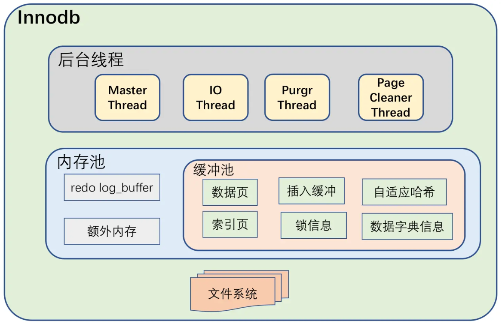

#### 体系结构
  

#### 后台线程
- Master Thread: 负责刷新缓冲(包括刷rodolog、合并Insert Buffer)，以保证数据的一致性
- IO Thread：负责AIO请求的回调处理
- Purge Thread：负责回收已经被使用并且被分配的UNDO页
- Page Cleaner Thread：负责刷新脏页

#### 内存
- 缓冲池：缓存的数据页类型有：索引页、数据页、undo页、插入缓冲（insert buffer）、自适应哈希索引（adaptive hash index）、InnoDB存储的锁信息（lock info）、数据字典信息（data dictionary）等
  - 多缓冲池优化：innodb_buffer_pool_instances
  - LRU淘汰策略优化：midpoint insertion strategy
    - innodb_old_blocks_time
    - innodb_old_blocks_pct
- 重做日志缓冲(rodo log buffer)：
  - Master Thread每秒将刷新一次到日志文件中
  - 每个事务提交时刷新
  - 重做日志缓冲池剩余空间小于1/2时刷新
- 额外的缓冲：对一些内部数据结构如buffer frame、buffer control block的内存分配

#### Check-Point技术
- Sharp Checkpoint
- Fuzzy Checkpoint
  - Master Thread Checkpoint (主线程每隔1/10秒do)
  - FLUSH_LRU_LIST Checkpoint (当LRU空闲页不足100个时do)
  - Async/Sync Flush Checkpoint (rodolog空间达到某个阈值时do)
  - Dirty Page too much Checkpoint (当脏页比例过大时do)

#### 关键特性
- 插入缓冲（Insert Buffer）
  - 使用条件：非唯一辅助索
  - Change Buffer：插入缓冲的升级，包括Inser Buffer、Delete Buffer、Purge Buffer
  - 内部实现：B+树
  - 合并时机：
    - 辅助索引页被读到缓冲池
    - Insert Buffer Bitmap追踪到辅助索引页无空余空间时 
    - Master Thread合并
- 两次写（Double Write）: 解决部分失效问题
- 自适应哈希索引（Adaptive Hash Index）
- 异步IO（Async IO）
- 刷新邻接页（Flush Neighbor Page）
